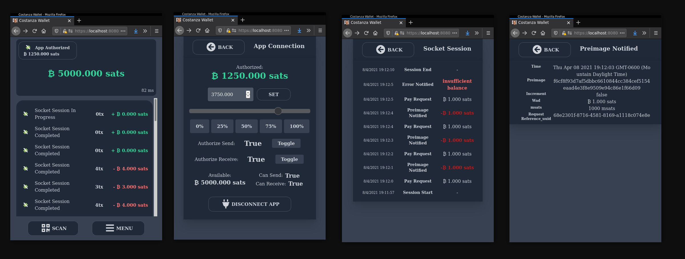

Costanza Wallet for Moneysocket
----

A socket-driven wallet for the [Moneysocket](https://socket.money) protocol utilzing the Lightning Network.

Run it now!
----

A build of this wallet is hosted on the web at [socket.money/wallet](https://socket.money/wallet)

What the heck is this?
----

This wallet's purpose is not to compete with leading wallets for daily driving. Its purpose is to demonstrate new paradigm for thinking about Lightning Network wallets. Also, to facilitate development of debugging of the Moneysocket protocol as it advances.

It is built in JavaScript to work in-browser. Though the buttons are big, intended for using on mobile touchscreens. It does not do Lightnin Network functionality itself, but rather tethers to a Moneysocket protocol provider such as the [Terminus](https://github.com/moneysocket/terminus) endpoint to obtain its balance and ability to transact with the Lightning Network.

The major feature is the ability to provide an upstream Moneysocket connection to an application, enabling the application to drive payments from this wallet. Along with that, the wallet controls the permissions for allowing or denying those automatic payments.

Disclaimer!
-----

Moneysocket is still new, under development and is Reckless with your money. Use this stuff at your own risk.

Dependencies
------------------------------------------------------------------------

This depends on [js-moneysocket](https://github.com/moneysocket/js-moneysocket) which will need to be installed into `node_modules` prior to building this project.

Also, additional dependencies referenced are package.json

Dev webserver
------------------------------------------------------------------------

To access a camera from the browser for scanning QR, it needs to be served from a `https` server, or else the browser will be unhappy.

[server.py](server.py) is provided with some certs that can be given exceptions for `localhost` from your browser while developing.

Costanza!
------------------------------------------------------------------------

Project Links
------------------------------------------------------------------------

- [Homepage](https://socket.money).
- [Twitter](https://twitter.com/moneysocket)
- [Telegram](https://t.me/moneysocket)
- [Donate](https://socket.money/#donate)
